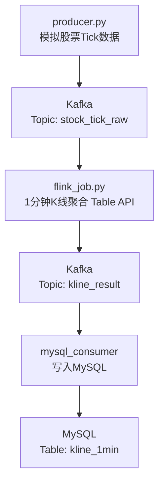

# Flink + Kafka + MySQL 实时股票K线计算系统

一个基于 PyFlink、Kafka 和 MySQL 的实时股票行情处理系统，实现1分钟K线聚合计算。

---

## 📋 项目简介

本项目构建了一个完整的实时数据管道，模拟股票行情数据，通过 Kafka 传输，使用 Flink 进行流式计算（1分钟K线聚合），最终将结果存储到 MySQL。

### 架构图

---

## 🚀 技术栈

| 组件 | 技术 | 版本 |
|------|------|------|
| 流计算引擎 | Apache Flink (PyFlink) | 1.18.0 |
| 消息队列 | Apache Kafka (Confluent) | 7.4.0 |
| 数据库 | MySQL | 8.0 |
| 容器管理 | Docker / Docker Compose | - |
| 编程语言 | Python | 3.10+ |

---

## 📁 项目结构
```text
pyflink_kafka_demo/
├── .venv/                          # Python虚拟环境
├── libs/
│   └── flink-sql-connector-kafka-3.2.0-1.18.jar  # Kafka连接器
├── docker-compose.yml              # Docker编排配置
├── flink_job.py                    # Flink作业 (核心)
├── producer.py                     # 数据生产者
├── mysql_consumer.py               # MySQL消费者
├── init.sql                        # MySQL初始化脚本
├── start-all.bat                   # 一键启动脚本
└── stop-all.bat                    # 一键停止脚本
```
---

## ⚙️ 环境准备

### 1. 基础要求

| 软件 | 版本要求 |
|------|----------|
| Python | 3.8 - 3.11 |
| Docker Desktop | 最新版 |
| Java | 11 (Flink依赖) |
| pip | 最新版 |

### 2. 安装依赖

```bash
# 创建虚拟环境
python -m venv .venv
.venv\Scripts\activate

# 安装Python依赖
pip install kafka-python mysql-connector-python apache-flink==1.18.0
```

### 3. 下载Kafka连接器
下载 flink-sql-connector-kafka-3.2.0-1.18.jar 并放入 libs/ 目录。
[下载地址](https://repo.maven.apache.org/maven2/org/apache/flink/flink-sql-connector-kafka/3.2.0-1.18/)

## 🏃 快速开始

### 第一步：启动基础设施
```bash
start-all.bat
```
这会自动：
启动 Zookeeper、Kafka、MySQL 容器
创建 Kafka Topics (stock_tick_raw, kline_result)
创建 MySQL 表 (kline_1min)

### 第二步：启动三个Python程序（分别开三个终端）
终端1 - 数据生产者：
```bash
python producer.py
```
终端2 - Flink作业：
```bash
python flink_job.py
```
终端3 - MySQL消费者：
```bash
python mysql_consumer.py
```
### 第三步：验证结果
```bash
docker exec mysql mysql -uroot -proot123 -e "USE stock_db; SELECT * FROM kline_1min ORDER BY window_start DESC LIMIT 10;"
```
### 停止服务
```bash
stop-all.bat
```
---
## 📊 核心代码说明
### 1. Flink Table API 实现K线聚合
```python
# 1分钟滚动窗口K线计算
t_env.execute_sql("""
    INSERT INTO kafka_sink
    SELECT
        symbol,
        TUMBLE_START(proc_time, INTERVAL '1' MINUTE) AS window_start,
        TUMBLE_END(proc_time, INTERVAL '1' MINUTE) AS window_end,
        FIRST_VALUE(price) AS open_price,
        MAX(price) AS high_price,
        MIN(price) AS low_price,
        LAST_VALUE(price) AS close_price,
        CAST(SUM(volume) AS BIGINT) AS volume
    FROM kafka_source
    GROUP BY symbol, TUMBLE(proc_time, INTERVAL '1' MINUTE)
""")
```
### 2. Kafka生产者 (模拟数据)
```python
def generate_tick():
    return {
        'symbol': random.choice(['AAPL', 'GOOGL', 'MSFT', 'AMZN', 'TSLA']),
        'price': round(random.uniform(100, 1000), 2),
        'volume': random.randint(100, 10000),
        'timestamp': int(time.time() * 1000)
    }
```
### 3. MySQL消费者
```python
consumer = KafkaConsumer(
    'kline_result',
    bootstrap_servers='localhost:9092',
    value_deserializer=lambda x: json.loads(x.decode('utf-8'))
)
```
---
## 📈 数据流示意
```text
输入数据 (stock_tick_raw)
┌─────────────────────────────────────────┐
│ {"symbol":"AAPL","price":178.5,"volume":2300} │
│ {"symbol":"AAPL","price":179.2,"volume":1500} │
│ {"symbol":"AAPL","price":178.1,"volume":3200} │
│ {"symbol":"AAPL","price":179.0,"volume":2100} │
└─────────────────────────────────────────┘
                    ↓
            Flink 1分钟窗口聚合
                    ↓
输出数据 (kline_result)
┌─────────────────────────────────────────┐
│ {"symbol":"AAPL","open":178.5,"high":179.2,  │
│  "low":178.1,"close":179.0,"volume":9100}   │
└─────────────────────────────────────────┘
```
---
## 🛠️ 常见问题
### Q: Kafka容器无法启动？
```bash
#清理数据卷后重启
docker-compose down
docker volume rm pyflink_kafka_demo_kafka_data
docker-compose up -d
```
### Q: Flink作业报 NoBrokersAvailable？
检查 docker-compose.yml 中 Kafka 的 KAFKA_ADVERTISED_LISTENERS 配置：
```yaml
environment:
  KAFKA_ADVERTISED_LISTENERS: PLAINTEXT://localhost:9092
```
### Q: 消费者收不到数据？
确认三个程序都在运行，等待1分钟后查询MySQL。
```bash
docker exec mysql mysql -uroot -proot123 -e "USE stock_db; SELECT * FROM kline_1min ORDER BY window_start DESC LIMIT 10;"
```

---
## 📝 项目亮点
完整的数据管道：从生产到消费，覆盖数据全生命周期

真实业务场景：模拟金融领域K线计算

技术栈全面：Flink + Kafka + MySQL + Docker

代码简洁：使用 Table API，50行核心代码完成聚合

一键部署：提供完整的启动脚本

---
## 📄 License
MIT

---
## 📧 联系方式
如有问题，欢迎交流！
