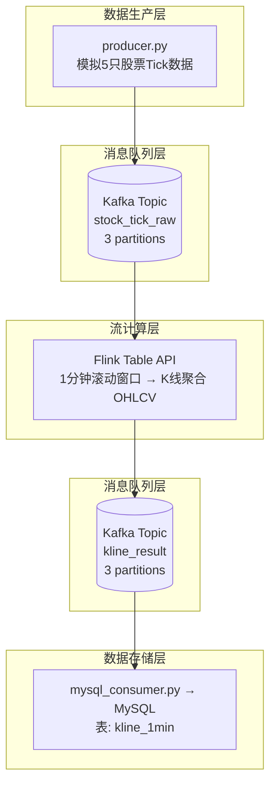

# Flink + Kafka + MySQL 实时股票K线计算系统

一个基于 PyFlink、Kafka 和 MySQL 的实时股票行情处理系统，实现1分钟K线聚合计算。

# Flink + Kafka + MySQL 实时股票K线计算系统

[](LICENSE)
[](https://www.python.org/)
[](https://flink.apache.org/)
[](https://kafka.apache.org/)
[](https://mysql.com/)

## 📋 目录

- [项目简介](#项目简介)
- [系统架构](#系统架构)
- [技术栈](#技术栈)
- [快速开始](#快速开始)
- [核心代码](#核心代码)
- [数据流说明](#数据流说明)
- [常见问题](#常见问题)
- [项目亮点](#项目亮点)
- [参考资源](#参考资源)
---

## 项目简介

本项目构建了一个**生产级别的实时数据处理管道**，模拟股票Tick行情数据，通过Kafka传输，使用Apache Flink进行流式计算（1分钟K线聚合），最终将结果持久化到MySQL。

### 适用场景

- 金融领域实时行情分析
- 物联网设备数据聚合
- 实时监控告警系统
- 学习Flink + Kafka实战

---

## 系统架构

---

## 技术栈

| 层级 | 技术 | 版本 | 说明 |
|------|------|------|------|
| 流计算 | Apache Flink (PyFlink) | 1.18.0 | 核心计算引擎 |
| 消息队列 | Apache Kafka | 7.4.0 | 数据总线 |
| 存储 | MySQL | 8.0 | 结果持久化 |
| 容器 | Docker / Docker Compose | - | 环境编排 |
| 语言 | Python | 3.10+ | 业务逻辑 |

---

## 项目结构
```text
pyflink_kafka_demo/
├── .venv/                              # Python虚拟环境
├── libs/
│   └── flink-sql-connector-kafka-3.2.0-1.18.jar
├── src/                                # 源代码目录
│   ├── flink_job.py
│   ├── producer.py
│   └── mysql_consumer.py
├── scripts/                            # 脚本目录
│   ├── start-all.bat
│   └── stop-all.bat
├── config/                             # 配置文件
│   └── docker-compose.yml
├── init.sql
├── LICENSE
└── README.md
```
---

## 快速开始

### 1. 环境要求

```bash
# 检查版本
python --version     # >= 3.8
docker --version     # 最新版
java -version        # 11
```

### 2. 安装步骤

```bash
# 1. 克隆项目
git clone https://github.com/gaopeiling/pyflink_kafka_demo.git
cd pyflink_kafka_demo

# 2. 创建虚拟环境
python -m venv .venv
source .venv/bin/activate      # Linux/Mac
.venv\Scripts\activate          # Windows

# 3. 安装依赖
pip install kafka-python mysql-connector-python apache-flink==1.18.0

```

### 3. 下载Kafka连接器
下载 flink-sql-connector-kafka-3.2.0-1.18.jar 并放入 libs/ 目录。
[下载地址](https://repo.maven.apache.org/maven2/org/apache/flink/flink-sql-connector-kafka/3.2.0-1.18/)

### 4. 启动系统

| 步骤 | 操作 | 说明 |
| :---: | :--- | :--- |
| 1 | `start-all.bat` | 启动Docker容器 + 初始化Topic/表 |
| 2 | `python producer.py` | 启动数据生产者 |
| 3 | `python flink_job.py` | 启动Flink作业 |
| 4 | `python mysql_consumer.py` | 启动MySQL消费者 |

### 5. 验证结果
```bash
docker exec mysql mysql -uroot -proot123 -e "USE stock_db; SELECT * FROM kline_1min ORDER BY window_start DESC LIMIT 10;"
```
### 停止服务
```bash
stop-all.bat
```
---
## 核心代码
### 1. Flink Table API 实现K线聚合
```python
# 1分钟滚动窗口K线计算
t_env.execute_sql("""
    INSERT INTO kafka_sink
    SELECT
        symbol,
        TUMBLE_START(proc_time, INTERVAL '1' MINUTE) AS window_start,
        TUMBLE_END(proc_time, INTERVAL '1' MINUTE) AS window_end,
        FIRST_VALUE(price) AS open_price,
        MAX(price) AS high_price,
        MIN(price) AS low_price,
        LAST_VALUE(price) AS close_price,
        CAST(SUM(volume) AS BIGINT) AS volume
    FROM kafka_source
    GROUP BY symbol, TUMBLE(proc_time, INTERVAL '1' MINUTE)
""")
```
### 2. Kafka生产者 (模拟数据)
```python
def generate_tick():
    return {
        'symbol': random.choice(['AAPL', 'GOOGL', 'MSFT', 'AMZN', 'TSLA']),
        'price': round(random.uniform(100, 1000), 2),
        'volume': random.randint(100, 10000),
        'timestamp': int(time.time() * 1000)
    }
```
### 3. MySQL消费者
```python
consumer = KafkaConsumer(
    'kline_result',
    bootstrap_servers='localhost:9092',
    value_deserializer=lambda x: json.loads(x.decode('utf-8'))
)
```
---
## 数据流说明
```text
输入数据 (stock_tick_raw)
┌─────────────────────────────────────────┐
│ {"symbol":"AAPL","price":178.5,"volume":2300} │
│ {"symbol":"AAPL","price":179.2,"volume":1500} │
│ {"symbol":"AAPL","price":178.1,"volume":3200} │
│ {"symbol":"AAPL","price":179.0,"volume":2100} │
└─────────────────────────────────────────┘
                    ↓
            Flink 1分钟窗口聚合
                    ↓
输出数据 (kline_result)
┌─────────────────────────────────────────┐
│ {"symbol":"AAPL","open":178.5,"high":179.2,  │
│  "low":178.1,"close":179.0,"volume":9100}   │
└─────────────────────────────────────────┘
```
---
## 常见问题
### Q: Kafka容器无法启动？
```bash
#清理数据卷后重启
docker-compose down
docker volume rm pyflink_kafka_demo_kafka_data
docker-compose up -d
```
### Q: Flink作业报 NoBrokersAvailable？
检查 docker-compose.yml 中 Kafka 的 KAFKA_ADVERTISED_LISTENERS 配置：
```yaml
environment:
  KAFKA_ADVERTISED_LISTENERS: PLAINTEXT://localhost:9092
```
### Q: 消费者收不到数据？
1.确认三个Python程序都在运行
2.等待1分钟（窗口触发）
3.检查Kafka消息：
```bash
docker exec kafka kafka-console-consumer --topic kline_result --bootstrap-server localhost:9092
```

---
## 项目亮点
| 步骤 | 亮点 | 说明 |
| :---: | :--- | :--- |
| 1 | 🎯 真实业务 | 模拟金融领域K线计算，贴近生产场景 |
| 2 | 🔧 技术全面 | Flink + Kafka + MySQL + Docker 完整技术栈 |
| 3 | 📦 开箱即用 | 一键启动脚本，3分钟上手 |
| 4 | 💡 代码简洁 | Table API，50行核心代码完成聚合 |
| 5 | 📊 数据完整 | 从生产到消费，覆盖数据全生命周期 |

---
## License
MIT License © 2026 Gao Peiling

---
## 参考资源
[Apache Flink 官方文档](https://flink.apache.org/)

[PyFlink 文档](https://nightlies.apache.org/flink/flink-docs-stable/docs/dev/python/overview/)

[Kafka 文档](https://kafka.apache.org/43/getting-started/introduction/)

---
## 联系方式
如有问题，欢迎交流！
